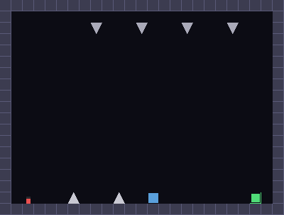
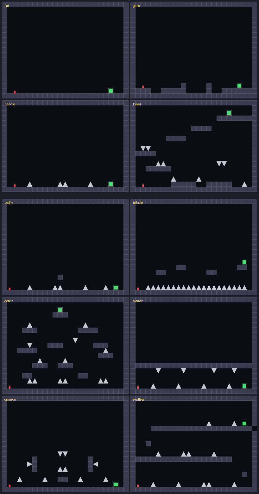
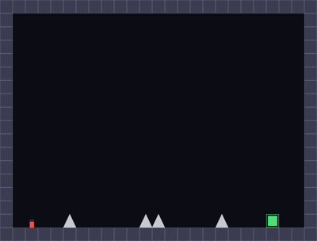
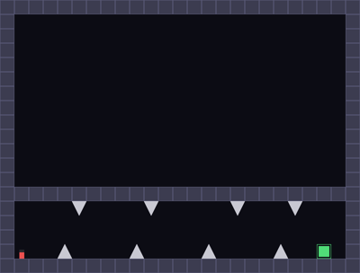
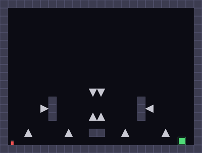
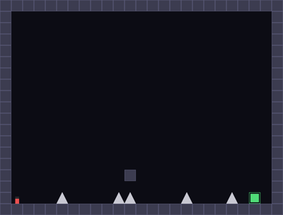
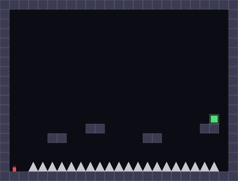
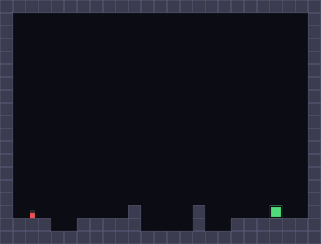
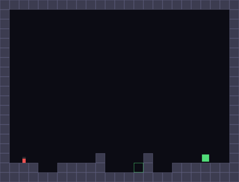
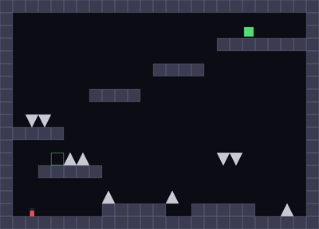

# iwanna-gym

A reinforcement-learning environment with **exact I Wanna Be The Guy fangame physics**, built for fast training and goal-conditioned RL research.

The player physics is a line-by-line C port of the [Renex GM8 fangame engine](https://github.com/RainbowSea5/renex-engine) (the Yuuutu-family engine most classic fangames are built on): 50 Hz frame loop, run speed 3 px/frame, jump −8.5, double jump −7, gravity 0.4, vertical speed cap 9, release-to-short-hop ×0.45, the 11×20 px player hitbox, GameMaker banker's rounding (the source of fangame "aligns"), pixel-stepped solid collision, and precise triangular spike hitboxes.

## Why

The "I Wanna" series (after [I Wanna Be The Guy](https://en.wikipedia.org/wiki/I_Wanna_Be_the_Guy), 2007) is a family of extremely difficult precision platformers. Thousands of fangames share one physics engine, one hitbox, and one skill ceiling — an ideal benchmark for RL: deterministic, pixel-perfect, sparse-reward, and with a natural task distribution (levels) over fixed dynamics. No RL environment existed for it before this one.

## Layout

```
iwanna-gym/
├── c_src/
│   ├── iwanna.h        # the entire engine: physics, collision, levels, obs, reward
│   ├── iwanna_capi.c   # ctypes shared-library API  ->  libiwanna.so
│   ├── binding.c       # PufferLib Ocean binding (drop into pufferlib/ocean/iwanna/)
│   └── iwanna_demo.c   # pure-C: keyboard play (raylib) or headless benchmark
├── config/iwanna.ini   # PufferLib training config
├── iwanna_gym/
│   ├── clib.py         # ctypes loader (auto-compiles libiwanna.so on first import)
│   ├── env.py          # IWannaEnv, IWannaGoalEnv, PixelObsWrapper
│   ├── levels.py       # level loading + procedural needle generator
│   ├── render.py       # numpy RGB renderer (800x608, 32 px tiles)
│   └── levels/         # text tilemaps (12 named levels + generated needles)
├── tests/              # test_physics.py (engine values), test_entities.py (entity system)
├── train_ppo.py        # SB3 PPO baseline (dense shaping)
├── train_her.py        # SB3 DQN + HER baseline (sparse goals)
├── train_gcppo.py      # goal-conditioned PPO baseline (random goals)
├── scripts/record_gif.py
└── docs/               # level montage + agent GIFs
```

## Quick start

```bash
pip install gymnasium numpy            # stable-baselines3 for train_ppo.py
python -c "import iwanna_gym"          # compiles libiwanna.so with gcc
python -m pytest tests/ -q             # physics unit tests
python train_ppo.py --level gaps --steps 400000
```

```python
import iwanna_gym as iw

env = iw.IWannaEnv(level="needle", reward_mode="dense", render_mode="rgb_array")
obs, info = env.reset(seed=0)
obs, r, term, trunc, info = env.step(5)   # run right + hold jump
frame = env.render()                       # (608, 800, 3) uint8
```

## Environments

| id | observation | notes |
|---|---|---|
| `IWanna-v0` / `IWannaEnv` | `Box(-1, 1, (101,))` | position, velocity, djump, on_ground, goal delta, 9×7 local tile window, 6 nearest dynamic entities (dx, dy, vx, vy, signed type) |
| `IWannaGoal-v0` / `IWannaGoalEnv` | `Dict(observation, achieved_goal, desired_goal)` | HER-ready `compute_reward`, random reachable goals, per-episode goal override |
| `PixelObsWrapper(env, factor=8)` | `Box(0, 255, (76, 100, 3))` | numpy-rendered RGB frames |

**Actions** — `Discrete(6)`: `2*(h+1) + jump_held` with `h ∈ {-1, 0, +1}`. Press/release edges are derived inside the core from consecutive `jump_held` values, exactly like GameMaker keyboard events, so short hops, full jumps, and double jumps all work.

**Rewards** — sparse (`+1` goal) or dense (distance-delta shaping, `0.01/px`), with a configurable death penalty. The core auto-resets on terminal (PufferLib convention); the Gymnasium wrapper stays API-correct.

**Levels** — text tilemaps, one char per 32 px tile: `#` block, `^ v < >` spikes, `S` start, `G` goal. Four built-ins (`flat`, `gaps`, `needle`, `tower`) plus `generate_needle(difficulty, seed)` for procedural single-screen needle levels. Lines starting with `@` spawn dynamic entities (see below).

## Entity system

Static tile geometry and dynamic objects are separate: tiles stay a flat `uint8` grid, while every moving or interactive object is an `IWEntity` (`type, x, y, vx, vy, state, timer, flags, trigger_id, collision_mask, params[6]`) in a fixed-capacity pool. Everything runs inside the C `step()` — no Python callbacks, no allocation after load, and deterministic replay from seed + action sequence is preserved (asserted in `tests/test_entities.py`).

| type | behavior |
|---|---|
| `platform` | jump-through moving platform; lands, carries, restores the air jump |
| `spikeball` / `enemy` | deadly oscillator (`vx/vy` + `range` around the spawn point) |
| `trigger` | invisible zone; on first touch fires all dormant entities with matching `id` |
| `trap` | dormant spike (deadly even while parked, fangame-style); launches with `vx/vy` when its trigger fires |
| `shooter` | spawns projectiles every `period` frames, fixed direction (`dir`) or `aimed=1` at the player |
| `projectile` | ballistic hazard (optional `grav`); culled outside the room |
| `save` | touching it moves the respawn point (checkpoint mode) |
| `warp` | teleports the player to `gx, gy` |
| `boss` | scaffold: fires radial 8-way bursts every `period`, `volleys` times (no player shooting yet) |

Spawn syntax in level text (`x y` in tiles, keys optional):

```text
@platform 8 13 vy=1 range=64
@trap 8 2 dir=down vy=7 id=1
@trigger 6 14 id=1 w=1 h=8
@shooter 23 8 dir=left period=90 speed=3
@save 4 16
@warp 4 6 gx=8 gy=2
```

Two showcase levels ship with the repo: `trap` (magnanimity-style triggered ceiling spikes — see the GIF below) and `factory` (moving platforms over a spike pit, an oscillating spikeball, and a wall shooter).



**Checkpoint mode** — `IWannaEnv(..., checkpoint_respawn=True)` switches death from episode-terminal to fangame semantics: the player respawns at the last touched save point, the episode continues, and `info["deaths"]` counts attempts. Default is off, preserving standard RL episode boundaries.

**Scale** — the acceptance benchmark in `tests/test_entities.py` steps a room with 1,050 simultaneously active entities at ~120k steps/s on one core (tiles-only stepping is unaffected at ~5M steps/s).

## Fangame-homage levels



Six additional levels pay homage to well-known fangames — drawn from the community's [Delicious-Fruit database](https://delicious-fruit.com/) (15k+ fangames, 115k+ reviews) and from the catalog of Bilibili streamer [逍遥散人](https://baike.baidu.com/item/%E9%80%8D%E9%81%A5%E6%95%A3%E4%BA%BA/3558908), whose 2011 series on I wanna be the magnanimity made the genre famous in China ([zh.wikipedia](https://zh.wikipedia.org/wiki/%E9%80%8D%E9%81%A5%E6%95%A3%E4%BA%BA)):

| level | homage | flavor |
|---|---|---|
| `boshy` | I Wanna Be The Boshy | speed-oriented ground corridor |
| `tribute` | I wanna be the tribute (散人 playthrough) | platform ladder over a spike pit |
| `dotkid` | DotKid stage, [I Wanna Kill The Kamilia 2](https://namu.wiki/w/I%20Wanna%20Kill%20The%20Kamilia%202) | open-room scattered-spike climb to a top goal |
| `sanren` | magnanimity-style trap corridor, named for 散人 | short-hop weave: ceiling spikes punish full jumps |
| `crimson` | [Crimson Needle](https://delicious-fruit.com/ratings/game_details.php?id=20889) | dense mixed-orientation needle |
| `endless` | I wanna be the Endless (made for 散人 by 优瓦夏) | three-tier snake: right, up, left, up, right |

## Physics fidelity

`tests/test_physics.py` asserts analytic engine values to 1e-9:

- run speed exactly 3 px/frame
- full-jump rise exactly **86.1 px** (applied deltas 8.1, 7.7, …, 0.1)
- double-jump arc exactly **57.8 px** (6.6, 6.2, …, 0.2) — together ≈ 4.5 tiles, matching the engine comment "jump 4.5 blocks"
- max applied fall speed exactly **9.4 px/frame**
- jump release multiplies rising vspeed by 0.45
- landing (and walking off a ledge) leaves exactly one air jump
- flush wall stop, spike death, goal detection, timeout

## Speed

Single core, random actions, headless: **~5.1M steps/sec** (~100,000× real time at 50 fps) on tile-only levels; ~120k steps/s with 1,000+ active entities.

```bash
cd c_src && gcc -O2 -DIW_NO_RAYLIB -o bench iwanna_demo.c -lm && ./bench 2
```

## PufferLib integration

The core follows the [PufferLib Ocean](https://github.com/PufferAI/PufferLib) native-env convention (`c_reset`/`c_step`/`c_render`/`c_close`, external buffers, internal auto-reset, `Log` struct):

```bash
git clone https://github.com/PufferAI/PufferLib && cd PufferLib
mkdir pufferlib/ocean/iwanna
cp <this-repo>/c_src/{iwanna.h,binding.c} pufferlib/ocean/iwanna/
cp <this-repo>/c_src/iwanna_demo.c pufferlib/ocean/iwanna/iwanna.c
cp <this-repo>/config/iwanna.ini config/
puffer build iwanna && puffer train puffer_iwanna
```

## Baselines and results

```bash
python train_ppo.py   --level sanren --steps 600000 --death-penalty 0.3 --ent 0.02
python train_her.py   --level gaps   --steps 200000        # DQN + HerReplayBuffer, sparse
python train_gcppo.py --level tower  --steps 600000        # PPO on random goals, dense
```

Stochastic-policy evaluation (argmax policies can lock into loops in this fully deterministic env — always evaluate with `deterministic=False`):

| level / task | algorithm | success |
|---|---|---|
| `gaps` | PPO (dense shaping) | 20/20 |
| `needle` | PPO | 17/20 |
| `boshy` | PPO | 14/20 |
| `tribute` | PPO | 20/20 |
| `sanren` | PPO | 20/20 |
| `crimson` | PPO | 20/20 |
| `dotkid` | PPO | 0/20 |
| `endless` | PPO | 0/20 |
| `gaps`, random goals | DQN + HER (sparse) | 44/50 |
| `tower`, random goals | goal-conditioned PPO (dense) | 9/50 |

`dotkid` and `endless` are deliberately kept: both are solvable (scripted trajectories reach the goal), but their routes are non-monotone in euclidean distance — the dense shaping that solves every other level actively misleads there. They are the built-in argument for methods that learn temporal distances instead, e.g. [contrastive RL](https://arxiv.org/abs/2206.07568) and [quasimetric approaches](https://arxiv.org/html/2406.17098v1).

| | | |
|---|---|---|
|  |  |  |
|  |  |  |
|  |  | |

## Goal-conditioned RL

`IWannaGoalEnv` resamples a reachable goal tile each episode and exposes normalized `(x, y)` achieved/desired goals, so it plugs directly into HER (e.g. `stable_baselines3.HerReplayBuffer` with the dict obs), contrastive RL, or any GCRL method. `reset(options={"goal": (px, py)})` sets an explicit goal; `compute_reward` is vectorized for relabeling.

HER note: relabeled transitions use the box-overlap goal test (`compute_reward` returns 1.0/0.0); death-penalty transitions are not relabel-consistent, which is accepted and documented behavior.

## Human play

```bash
cd c_src && gcc -O2 -o demo iwanna_demo.c -lraylib -lm && ./demo 2
# arrows move, shift/Z jump (tap for short hop, again in air for double jump)
```

## License

MIT. Engine semantics derived from the open-source Renex engine for GM8.2.
