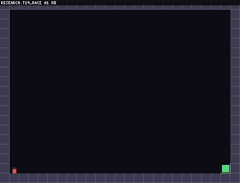
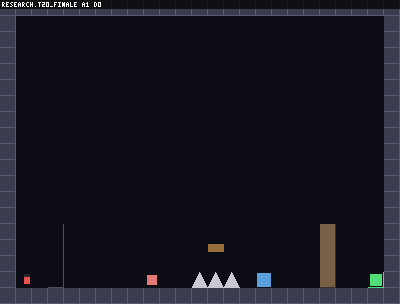

# Discovery pilot report — results against the pre-registration

> **CORRECTION NOTICE (measurement repair, supersedes parts of this
> report).** A post-pilot audit found the discovery evaluator read the
> player position AFTER the C core had already respawned, so every
> `death_xy` in the original pilot records is the CHECKPOINT, not the
> death location. This affected **only position-derived metrics**:
> **repeated-death rate (RDR)** and the "deaths are repeatable" and H3
> readings below are **SUPERSEDED**. **Verified scope of the "unchanged" claim** (do not read it more
> broadly): a per-field old-vs-corrected re-evaluation covered the
> **P1 suite, seed-1 training checkpoints, all four policies, 42
> task-runs each (14 eval tasks x 3 eval seeds) = 168 task-runs**
> (`scripts/verify_reeval.py` ->
> `build/discovery_pilot_corrected/reeval_coverage.json`). Across every
> eligible (non-deathmem) run in that scope the success-family fields:
> `success`, `attempts_to_success`, `frames_to_success`, `n_attempts`,
> `n_deaths`, `censored` are **bit-identical** old vs corrected, while
> `repeated_death_rate` changed. The aggregate check
> (`verification.json`) additionally confirms Success@K and AUC
> identical for ff/gru/gru_reset seed-1 (ff 0.643/0.640, gru 0.286/
> 0.286, gru_reset AUC 0.281). Because those success-family metrics are
> what H1/H2/H4 rest on and are verified unchanged in this scope, **the
> H1, H2, H4 verdicts stand** for the reported P1 results. NOT verified
> per-field in this pass: seeds 2-3 and pilots P2/P3; the argument
> that they cannot read death positions still holds, but treat their
> success-family numbers as argued-unchanged, not verified-unchanged.
> Corrected RDR (position-fixed, room-gated): ff 0.991->0.934,
> gru 1.0->0.990, gru_reset 1.0->0.969. **H3 remains REQUIRING A
> RETRAIN**: the `deathmem` agent was *trained* with a second bug
> (timeouts counted as deaths in its episodic memory), so its behavior,
> not merely its metrics, is affected; re-evaluation cannot restore
> the intended agent, and `deathmem` is excluded from every "unchanged"
> claim above. Both bugs are fixed at the repair commit; a rerun is
> deferred (this milestone stops before another training pilot). The
> original pilot data and this report's pre-repair numbers are
> preserved below as the historical record.

Pre-registration: [discovery_pilot_prereg.md](discovery_pilot_prereg.md)
(committed one commit before any result in `build/discovery_pilot/`).
Raw per-attempt records, per-seed aggregates, the analysis JSON, tables
and SVG plots: `build/discovery_pilot/` (regenerate with
`PYTHONPATH=. python scripts/analyze_pilot.py`; rerun everything with
`scripts/run_pilot.py all`). Scale disclaimer up front: **this is a
2-CPU-core pilot at 3–5M env steps per run — a machinery-validation
scale, far below convergence for these tasks.** Nothing here is a paper
conclusion; several verdicts are "underpowered" by the pre-registered
rules, and they are reported as such.

## Headline table (mean±sd over seeds; per-seed values in analysis.json)

P1 = all 14 active controlled-discovery tasks (trained on the 9
train-split tasks); P2 = the four audit-excluded precision-only rooms;
P3 = the sole active native task (chalice_hall). Eval task seeds
{11,12,13}; observable observations and sparse reward everywhere.

See `build/discovery_pilot/tables.md` (embedded):

P1 discovery: ff S@K 0.381±0.338, AUC 0.379; gru 0.214±0.124,
gain −0.000; gru_reset 0.214±0.189, gain 0.047; deathmem 0.294±0.192,
gain 0.053. P2 precision: ff 0.000; gru 0.167±0.236;
gru_reset 0.375±0.177; deathmem 0.875±0.177. P3 native: all policies
0.000 at 3M steps.

## Hypothesis verdicts (pre-registered decision rules)

- **H1 (memory > reset ablation on discovery): NOT SUPPORTED —
  underpowered with a point estimate of ~zero.** Paired per-seed AUC
  gap gru − gru_reset = **+0.008 ± 0.159 (SE)**, per-seed diffs
  {+0.005, +0.286, −0.266}: the sign flips across seeds and the mean is
  two orders of magnitude below its uncertainty. At this scale the
  causal comparison shows **no evidence that carried recurrent state
  exploits informative failure.**
- **H2 (gap shrinks on precision controls): rule technically met,
  interpretation withheld.** The pre-registered interaction
  (P1 gap − P2 gap) = +0.218 > 0, but it is driven entirely by the
  precision-room gap being NEGATIVE (−0.210 ± 0.040: gru
  *underperforms* its own reset ablation on precision rooms), not by a
  positive discovery gap. With H1 null, the honest reading is
  "recurrence costs optimization performance on precision rooms," not
  "memory helps on discovery."
- **H3 (deathmem lowers repeated deaths): NOT SUPPORTED.** RDR
  deathmem − ff = **+0.024 ± 0.019** — the wrong direction, small.
  Everyone re-dies at revealed hazards at this scale (RDR ≈ 1.0 across
  the board).
- **H4 (held-out transfer is harder): SUPPORTED, strongly and for
  every policy.** Train-split vs held-out AUC: ff 0.553 → 0.067;
  gru 0.333 → 0.000; gru_reset 0.257 → 0.115; deathmem 0.380 → 0.132.
  The screen+family split does what it was built to do — training-task
  skill does not transfer, so any future within-task adaptation signal
  on held-out tasks will be attributable to discovery, not
  memorization.

## The most important empirical finding

**The causal memory comparison is null at pilot scale while the
benchmark's control machinery demonstrably works.** Two specific
observations matter for the paper's framing:

1. **Stochastic retry masquerades as adaptation.** Evaluation samples
   from the policy, so success-by-attempt rises with k for MEMORYLESS
   policies too (ff gain 0.046; its die→succeed eval runs — e.g.
   t12_gauntlet, 2 attempts — are re-rolls, not learning). Adaptation
   claims must always be read as differences against the
   ablation/memoryless control; the benchmark provides exactly that
   control, and at this scale the difference is zero.
2. **High RDR** (corrected ~0.93–0.99; the pre-repair 1.0 figures are
   superseded) is consistent with agents re-dying at the same place,
   but — per the correction — a high repeated-death rate is a spatial
   PROXY and does **not by itself prove informative failure**: it shows
   deaths recur near one another (now gated by room), not that a
   failure trajectory carried usable information the agent could have
   exploited. Establishing informative failure requires the H1-style
   causal comparison (memory vs ablation) or the scripted informed-vs-
   blind probe (B2) — not RDR. What RDR does show at this scale: no
   pilot agent reduces repeated deaths, a capability/budget gap, not a
   verdict on the benchmark.

## Qualitative trajectories (own schematic renderer; no third-party assets)

-  —
  `t14_race`: death to the hidden 3-second flood, then a successful
  next attempt (gru_reset checkpoint; a stochastic-retry success, per
  finding 1 — labeled as such, not as memory-driven adaptation).
-  —
  `t20_finale`: the dominant failure mode — eight consecutive deaths
  at the same early hazard chain (RDR 1.0), no cross-attempt
  adjustment.

## Alternative-explanation audit

- **Reward shaping:** none — sparse reward in every run; no
  distance shaping anywhere in the pilot.
- **Task-ID/layout memorization:** no task identifiers reach any
  policy (obs only); H4 shows held-out performance collapses, so
  train-split numbers do include layout learning — which is why all
  claims are split-resolved and headline transfer claims would use
  held-out tasks only.
- **Privileged leakage:** all runs observable_vector; the paired
  anti-leakage tests (milestone 14) pin the mode; no oracle record
  enters any table (enforced by the evaluator's file segregation).
- **Parameter counts:** ff 30,471; gru/gru_reset 112,647 (matched
  EXACTLY within the causal pair — the H1 comparison is parameter- and
  interaction-identical); deathmem 43,527. Cross-family comparisons
  (ff vs gru) are confounded by size and are not used for claims.
- **Unequal budgets:** identical env-step budgets, rollout shapes,
  optimizer and eval protocol within each pilot (configs committed
  before results).
- **Easy-subset selection:** the native pilot used the only witnessed
  native task and scored 0.000 for every policy — no favorable
  selection occurred; the discovery suite used ALL active tasks, not a
  curated subset.
- **Recurrence-optimization confound (found by this audit):** gru's
  P1 gain is exactly −0.000 because its successes are all attempt-1 —
  and it underperforms its own ablation on precision rooms. At this
  scale, BPTT optimization difficulty, not memory content, dominates
  the recurrent results.

## Throughput during the pilot (2 cores, 24 envs, observable obs)

ff ~100–107k end-to-end SPS; deathmem ~74–76k; gru/gru_reset ~18–24k
(BPTT-bound). Native rooms train at ~18–41k SPS. Full logs per run in
`build/discovery_pilot/*/*/train_log.jsonl`.

## What this pilot changes

The benchmark's measurement machinery held up: splits separate
memorization from discovery (H4), fixed hidden state makes failures
repeatable (RDR), the causal pair isolates the memory boundary, and
pre-registration prevented a null result from being dressed up.
What is missing is an agent that uses the information — and compute.
Next steps are in [paper_readiness.md](paper_readiness.md).
